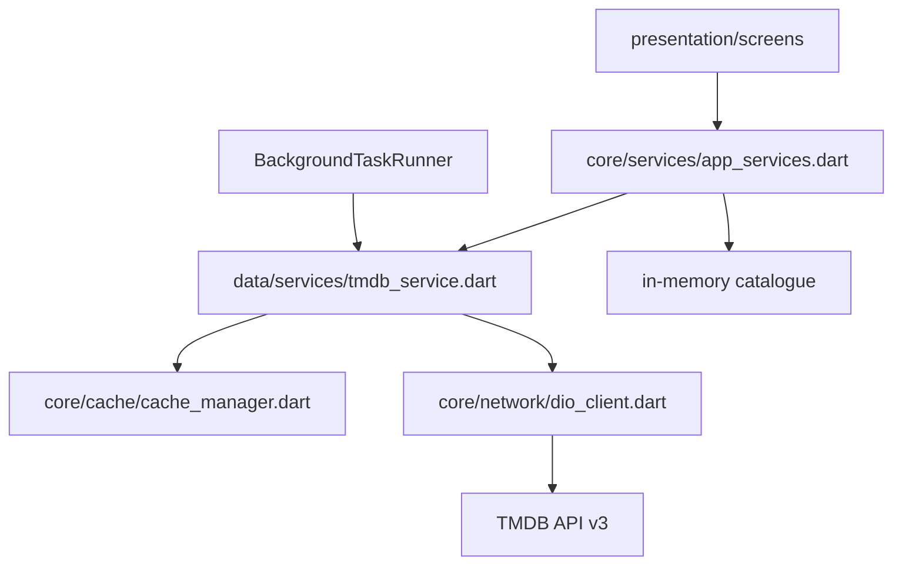

# Architecture

## Overview

IzShowTime is a Flutter app for tracking films and TV shows using the TMDB API. Data flows through a layered structure:



## Layers

### Presentation (`lib/presentation/`)

- **Screens**: Home (trending), Search, Catalogue, Tracking, Settings
- **Widgets**: `DebounceSearchWidget`, `MediaCard`, `MediaPosterCard`
- **Navigation**: `MainNavigator` with bottom bar + named routes via `AppRouter`

### Core (`lib/core/`)

| Module | Responsibility |
|--------|----------------|
| `constants/` | API URLs, cache TTLs, debounce timing |
| `network/dio_client.dart` | HTTP client, retries on 429 |
| `cache/` | In-memory cache with TTL |
| `routing/app_router.dart` | Named routes and `onGenerateRoute` |
| `services/app_services.dart` | Singleton: catalogue, TMDB, background tasks |
| `background/` | Periodic trending refresh |
| `theme/` | Light/dark Material 3 themes |

### Data (`lib/data/`)

- **Models**: `CatalogueItem`, `Film`, `TvShow`, `EpisodeModel`, `Tag`
- **Services**: `TmdbService` — single entry point for TMDB with JSON parsing

## State management

In-memory catalogue via `AppServices` singleton. Screens call `setState` after catalogue changes. Persistent storage is planned for a future phase.

## API token

For local debug, copy `environment.local.example` to `environment.local` and set `TMDB_API_KEY`. That file is gitignored. IDE debug (F5) and `flutter run` from Cursor load it via `--dart-define-from-file=environment.local`.

The token is sent as `Authorization: Bearer <token>`.

CLI without a local file:

```bash
flutter run --dart-define=TMDB_API_KEY=your_token_here
```

## Caching

- **L1**: In-memory `CacheManager` with TTL per request type
- **Rate limiting**: `ApiCacheService` tracks requests per minute (40 cap)
- **Background**: Refreshes trending data every 4 hours

Persistent Hive/SQLite cache is not implemented in the current revision.
